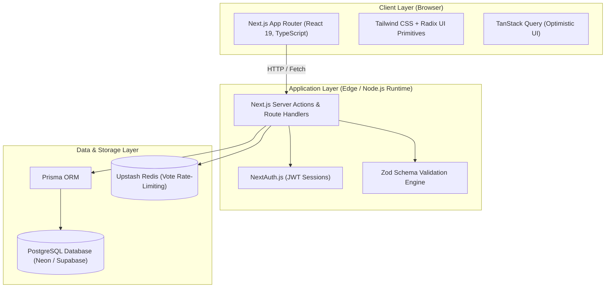
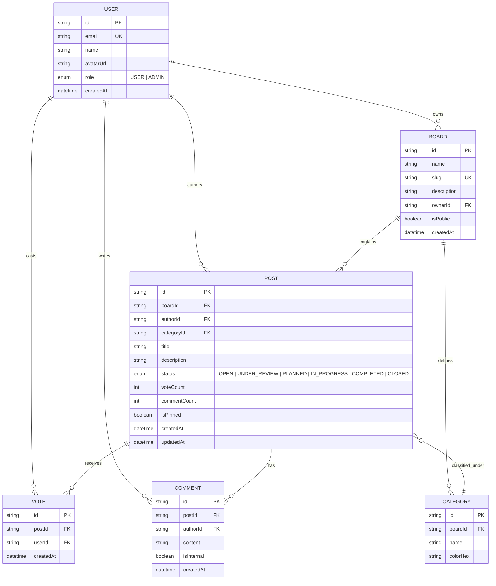
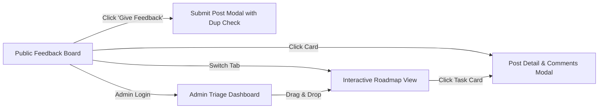

# FeaturePulse — Full-Stack Application Architecture

[](#)
[](#)

> **Submission for SWYNEX Technologies Internship — Task 1: Project Architecture**  
> **Repository Name:** `SWYNEX-Project-Architecture`  
> **Author:** Geeta  
> **Tech Stack:** Next.js 15 (App Router), React 19, TypeScript, PostgreSQL, Prisma ORM, Tailwind CSS  

---

## 1. Product Overview & Core Idea

### 1.1 Product Name & Vision
**FeaturePulse** is an interactive customer feedback and public roadmap platform designed for agile software teams, startups, and open-source projects. It centralizes feature requests, bug reports, and user ideas into a structured, vote-driven dashboard to help teams prioritize what to build next.

### 1.2 Target Audience & Personas
- **Product Managers & Developers:** Need a transparent way to triage user feedback, identify top-voted features, and communicate progress via an interactive roadmap.
- **End Users & Customers:** Want a simple portal to suggest features, upvote items they care about, and track the status of ideas in real time.

### 1.3 Key Features (MVP vs Post-MVP)
| Feature | Description | MVP | Post-MVP |
|---|---|:---:|:---:|
| **Public Feedback Wall** | Filterable & sortable list of user feedback items (Trending, Top, New) | ✅ | — |
| **One-Click Upvoting** | Atomic upvote toggle with client-side optimistic UI and deduplication | ✅ | — |
| **Interactive Roadmap** | 3-column Kanban view (*Planned*, *In Progress*, *Completed*) | ✅ | — |
| **Post Submission & Search** | Submission modal with real-time duplicate suggestions | ✅ | — |
| **Threaded Comments** | Markdown-enabled discussion on individual feedback items | ✅ | — |
| **Admin Triage Console** | Role-based status updates, pinning, category tagging, and moderation | ✅ | — |
| **Email Status Notifications** | Automated alerts when an upvoted post changes state | ❌ | 🚀 Phase 2 |
| **Custom Domains & Theming** | Subdomain routing (`feedback.customer.com`) with custom branding | ❌ | 🚀 Phase 2 |

---

## 2. High-Level System Architecture



---

## 3. Data Models & Entity Relationship Diagram (ERD)



---

## 4. API Routes & Endpoint Specifications

All endpoints return JSON and follow standard REST conventions.

| Method | Path | Auth Level | Description |
|---|---|:---:|---|
| `GET` | `/api/boards/:slug` | Public | Retrieve board configuration and category tags |
| `GET` | `/api/boards/:slug/posts` | Public | Paginated list of posts (filterable by status, category, sort) |
| `POST` | `/api/boards/:slug/posts` | User | Submit a new feedback post |
| `GET` | `/api/posts/:id` | Public | Retrieve single post details with vote status and comments |
| `POST` | `/api/posts/:id/vote` | User | Atomic toggle for upvoting/downvoting |
| `POST` | `/api/posts/:id/comments` | User | Post a discussion comment |
| `PATCH`| `/api/posts/:id/status` | Admin | Change post status (e.g. `PLANNED` -> `IN_PROGRESS`) |
| `GET` | `/api/boards/:slug/roadmap`| Public | Grouped posts for Kanban roadmap columns |

---

## 5. Frontend Screens & User Flows



### Screen Breakdown
1. **Screen 1: Public Feedback Wall (`/b/:slug`)**
   - Header with search, category pills, and sort dropdown (*Trending*, *Top*, *New*).
   - Post cards with instant upvote button, tag badge, comment counter, and author info.
2. **Screen 2: Post Detail & Discussion Modal (`/b/:slug/posts/:id`)**
   - Deep-linkable modal with markdown description, status history pill, and nested discussion thread.
3. **Screen 3: Interactive Roadmap View (`/b/:slug/roadmap`)**
   - 3-column Kanban layout (*Planned*, *In Progress*, *Completed*) with drag-and-drop status adjustment for admins.
4. **Screen 4: Post Submission Modal (`/b/:slug/new`)**
   - Form with title, category dropdown, markdown details textarea, and live duplicate search suggestions.
5. **Screen 5: Admin Triage & Management Console (`/admin/:slug`)**
   - Moderator controls for status transitions, internal dev notes, spam filtering, and CSV export.

---

## 6. Starter Repository Quickstart

```bash
# Clone the repository
git clone https://github.com/<your-username>/SWYNEX-Project-Architecture.git
cd SWYNEX-Project-Architecture

# Install dependencies
npm install

# Push database schema
npx prisma db push

# Run development server
npm run dev
```
