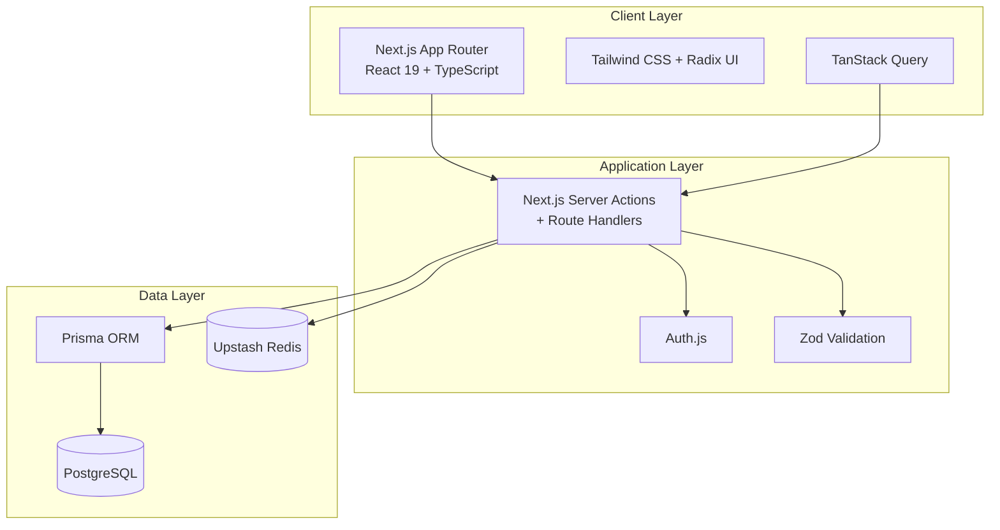

# 🚀 FeaturePulse

> **A modern customer feedback, feature request, and public roadmap platform for startups and product teams.**

FeaturePulse replaces scattered Discord threads, support tickets, and spreadsheets with a centralized feedback hub where customers can **submit ideas, upvote requests, discuss features, and track product progress**.

Built with **Next.js, React, TypeScript, PostgreSQL, Prisma, Auth.js, and Redis**.

---

## ✨ Features

### 📢 Public Feedback Board

- Browse customer feedback and feature requests
- Filter by status and category
- Sort by:
  - 🔥 Trending
  - ⭐ Top Voted
  - ✨ Newest
- Search existing feedback
- View vote and comment counts

### 👍 Upvoting

- One-click upvote system
- Optimistic UI updates
- Prevents duplicate votes
- Atomic database transactions
- Redis-based rate limiting

### 🗺️ Interactive Roadmap

Visualize product development using a Kanban-style roadmap:

| Planned | In Progress | Completed |
|---|---|---|
| Upcoming features | Currently developing | Shipped features |

Admins can move features between roadmap stages using drag-and-drop.

### 💬 Discussions

- Threaded comments
- Markdown support
- Chronological discussions
- Admin/owner badges
- Internal admin-only notes

### 📝 Feature Submission

Users can submit new feature requests with:

- Title
- Category
- Detailed description
- Markdown formatting

FeaturePulse also performs a **duplicate suggestion search** while users type, encouraging them to upvote an existing request instead of creating duplicates.

### 🔐 Authentication

Authentication supports:

- Google OAuth
- GitHub OAuth
- Magic Links
- JWT-based sessions
- User/Admin roles

### 🛠️ Admin Triage Console

Admins can:

- Change feature status
- Pin important requests
- Categorize posts
- Moderate discussions
- Move features across roadmap stages

---

## 🏗️ Architecture

FeaturePulse follows a modern full-stack architecture built around Next.js.



---

## 🧰 Tech Stack

| Technology | Purpose |
|---|---|
| **Next.js** | Full-stack web framework |
| **React 19** | UI framework |
| **TypeScript** | Type safety |
| **Tailwind CSS** | Styling |
| **Radix UI** | Accessible UI primitives |
| **Lucide Icons** | Icon system |
| **TanStack Query** | Client-side data fetching & optimistic mutations |
| **PostgreSQL** | Primary database |
| **Prisma** | Type-safe ORM |
| **Auth.js** | Authentication |
| **Upstash Redis** | Rate limiting & caching |
| **Zod** | Request/schema validation |
| **Marked** | Markdown parsing |
| **DOMPurify** | Markdown/content sanitization |

---

## 📊 Data Model

The core entities are:

```text
User
 ├── Boards
 ├── Posts
 ├── Votes
 └── Comments

Board
 ├── Categories
 └── Posts

Post
 ├── Votes
 ├── Comments
 └── Category
```

### Main Models

#### User

```text
id
email
name
avatarUrl
role
createdAt
```

Roles:

```text
USER
ADMIN
```

#### Board

```text
id
name
slug
description
ownerId
isPublic
createdAt
```

#### Post

```text
id
boardId
authorId
categoryId
title
description
status
voteCount
commentCount
isPinned
createdAt
updatedAt
```

Available statuses:

```text
OPEN
UNDER_REVIEW
PLANNED
IN_PROGRESS
COMPLETED
CLOSED
```

#### Vote

Each user can vote on a post only once.

```text
id
postId
userId
createdAt
```

The database uses:

```prisma
@@unique([postId, userId])
```

to prevent duplicate votes.

#### Comment

```text
id
postId
authorId
content
